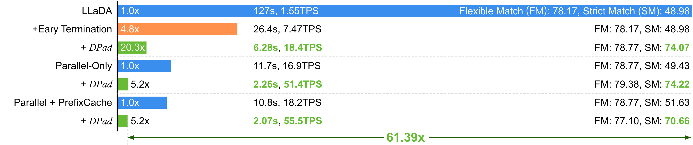
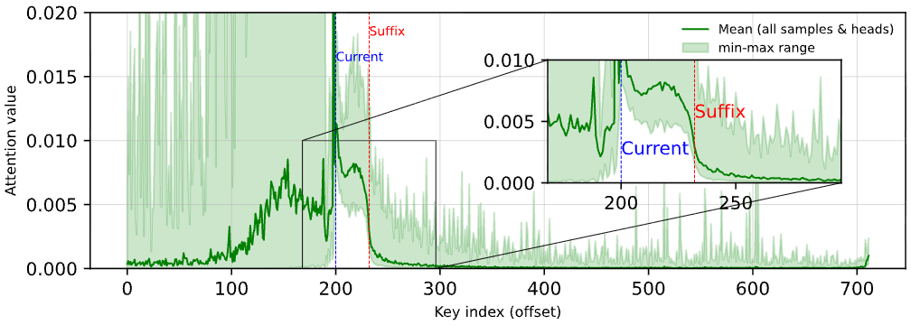
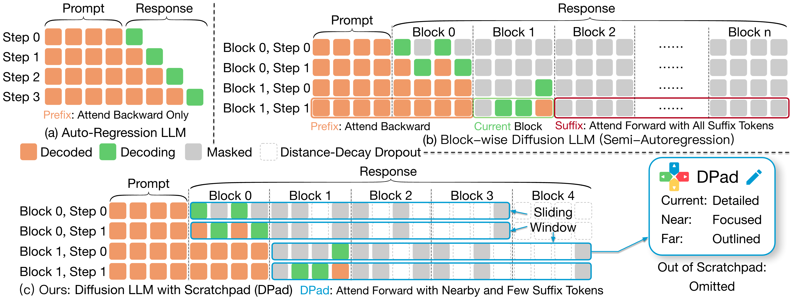
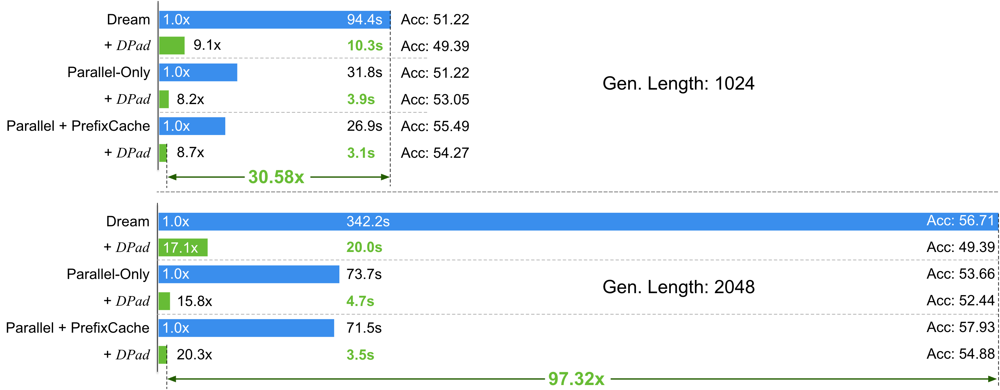

<p align="center">
    
</p>


## DPad: Efficient Diffusion Language Models with Suffix Dropout

<p align="left">
  <a href="https://arxiv.org/abs/submit/6718185"><b>📄 Paper</b></a>
  </p>

<p align="center">
  </p>
<hr>
<p align="center">
    
    <br>
    <small><b>Efficiency:</b> DPad-enhanced dLLMs achieve up to a <b>61.39× speedup</b> over vanilla dLLM baselines.</small>
    <br>
    <small><b>Accuracy:</b> DPad-enhanced dLLMs achieve up to a <b>+26.46% improvement</b> over vanilla dLLM baselines.</small>
    <br>
    <small>(Evaluation conducted on NVIDIA A100-PCIe-80GB GPUs).</small>
</p>

**Diffusion Scratchpad (DPad)** is a novel training-free inference paradigm that overcomes a key efficiency bottleneck in Diffusion Language Models (dLLMs): the high computational cost of full suffix attention. By intelligently pruning redundant suffix tokens, DPad achieves:

- Up to a staggering **61.39x acceleration** over vanilla dLLM baselines on long-sequence benchmarks.
- A significant improvement in **strict-match accuracy** on reasoning tasks by enhancing in-context learning.
- Comparable or better generation quality on standard reasoning and coding benchmarks.
- **Seamless integration** with existing optimizations like parallel decoding and prefix caching for multiplicative speedups.

This repository provides the code to reproduce our evaluation results.

## 🔥 News!
* Aug 19, 2025: We've released our paper on DPad!
## Contents
- [DPad: Efficient Diffusion Language Models with Suffix Dropout](#dpad-efficient-diffusion-language-models-with-suffix-dropout)
- [🔥 News!](#-news)
- [Contents](#contents)
- [🤔 How It Works](#-how-it-works)
- [✨ Key Features \& Modifications](#-key-features--modifications)
- [📊 Performance Highlights](#-performance-highlights)
- [🚀 Scaling with Long Sequences \& Other Optimizations](#-scaling-with-long-sequences--other-optimizations)
- [🚀 Usage Guide](#-usage-guide)
  - [1. Installation](#1-installation)
  - [2. Evaluation](#2-evaluation)
    - [LLaDA](#llada)
    - [Dream](#dream)
  - [3. Generation Demo](#3-generation-demo)
- [📚 Future Works](#-future-works)
- [🙏 Acknowledgements](#-acknowledgements)
- [©️ Citation](#️-citation)

## 🤔 How It Works

DPad overcomes the high computational overhead of dLLMs, where models predict all future suffix tokens at each step while retaining only a small fraction.



**1. The "Scratchpad" Insight:** We identify that suffix tokens function as an information reservoir—a "scratchpad"—that collects signals from already decoded prefix tokens to guide generation. However, we found that most of these suffix tokens are redundant and their importance decays sharply with distance.

**2. The Diffusion Lottery Tickets (DLT) Hypothesis:** We find that even pruning high-attention "spike" tokens in the distant suffix has little effect on accuracy, as the model dynamically shifts its attention to nearby tokens. This suggests that a sparse subset of suffix tokens is sufficient. DPad acts as a training-free lottery ticket search, finding an efficient "winning ticket" for generation on the fly.

**3. Suffix Dropout Mechanisms:** DPad introduces two simple, training-free strategies to eliminate this redundancy before attention computation:

* **Sliding Window:** Maintains a fixed-length suffix window, preventing computation from scaling with the full sequence length.
* **Distance-Decay Dropout:** Progressively prunes distant suffix tokens using a Gaussian sampling strategy, focusing computation on the most relevant nearby tokens.

<p align="left">
    
    <br>
    <small><b>Overview of DPad vs. other generation methods:</b> 
    <br>
      (a) Autoregressive models generate one token at a time. <br>
      (b) Standard dLLMs attend to all suffix tokens, incurring high computational costs. <br>
      (c) DPad restricts attention to a small, nearby set of suffix tokens, eliminating redundant computation while preserving fidelity.</small>
</p>

## ✨ Key Features & Modifications 

This repository is built upon the [Fast-dLLM](https://github.com/NVlabs/Fast-dLLM) codebase and incorporates the following key features and modifications to implement the DPad methodology: 

* **Simplified Command-Line Interface**: To simplify experiments, the original complex commands have been wrapped into a user-friendly `run.py` script. You can now run evaluations and generation with simple, intuitive arguments. 

* **Dynamic Suffix Sampling (DPad Core)**: The core of DPad is implemented in `sampler.py` and integrated into the main generation pipelines (`llada/generate.py` for LLaDA and `dream/model/generation_utils_block.py` for Dream). This module applies distance-decay dropout within the sliding window before the decoding process of each block, efficiently pruning redundant suffix tokens.

* **Expanded Model Support**: We have extended support to include the full semi-autoregressive mode for the `Dream-Base` model, enabling comprehensive evaluation across different dLLM architectures. 

* **Adaptive Positional Embeddings (RoPE)**: We have modified the RoPE implementation to correctly handle the non-contiguous token sequences that result from our suffix dropout. This ensures each token retains its original positional information, maintaining the integrity of the model's spatial awareness.


## 📊 Performance Highlights

DPad delivers transformative speedups while maintaining or improving scores. Below is a comprehensive summary of performance on **LLaDA-Instruct** , **LLaDA-1.5** and **Dream-Base**, comparing our method against the original vanilla baseline and the optimized parallel decoding variant (Fast-dLLM).

<center>
<strong>Performance on LLaDA-Instruct</strong>

<table style="width:100%; border-collapse: collapse; text-align:left;">
  <thead style="background-color:#f2f2f2;">
    <tr>
      <th style="padding: 8px; border: 1px solid #ddd;">Benchmark</th>
      <th style="padding: 8px; border: 1px solid #ddd;">Metric</th>
      <th style="padding: 8px; border: 1px solid #ddd;">Vanilla</th>
      <th style="padding: 8px; border: 1px solid #ddd;">+DPad</th>
      <th style="padding: 8px; border: 1px solid #ddd;">+Parallel (Fast-dLLM)</th>
      <th style="padding: 8px; border: 1px solid #ddd;">+Parallel+DPad (Ours)</th>
    </tr>
  </thead>
  <tbody>
    <tr>
      <td rowspan="3" style="padding: 8px; border: 1px solid #ddd; vertical-align: middle;"><strong>GSM8K</strong><br><em>4-shot</em></td>
      <td style="padding: 8px; border: 1px solid #ddd;">Latency(s) ↓</td>
      <td style="padding: 8px; border: 1px solid #ddd;">27.48</td>
      <td style="padding: 8px; border: 1px solid #ddd;">18.35 <span style="color: green;">(1.50x)</span></td>
      <td style="padding: 8px; border: 1px solid #ddd;">8.55 <span style="color: green;">(3.21x)</span></td>
      <td style="padding: 8px; border: 1px solid #ddd;"><strong>6.64 <span style="color: green;">(4.14x)</span></strong></td>
    </tr>
    <tr>
      <td style="padding: 8px; border: 1px solid #ddd;">Flexible Acc. ↑</td>
      <td style="padding: 8px; border: 1px solid #ddd;">78.39</td>
      <td style="padding: 8px; border: 1px solid #ddd;">78.54</td>
      <td style="padding: 8px; border: 1px solid #ddd;">78.54</td>
      <td style="padding: 8px; border: 1px solid #ddd;">79.76</td>
    </tr>
    <tr>
      <td style="padding: 8px; border: 1px solid #ddd;">Strict Acc. ↑</td>
      <td style="padding: 8px; border: 1px solid #ddd;">37.38</td>
      <td style="padding: 8px; border: 1px solid #ddd;">63.84</td>
      <td style="padding: 8px; border: 1px solid #ddd;">38.67</td>
      <td style="padding: 8px; border: 1px solid #ddd;">64.97</td>
    </tr>
    <tr style="background-color: #fafafa;">
      <td rowspan="3" style="padding: 8px; border: 1px solid #ddd; vertical-align: middle;"><strong>MATH</strong><br><em>4-shot</em></td>
      <td style="padding: 8px; border: 1px solid #ddd;">Latency(s) ↓</td>
      <td style="padding: 8px; border: 1px solid #ddd;">25.40</td>
      <td style="padding: 8px; border: 1px solid #ddd;">21.61 <span style="color: green;">(1.18x)</span></td>
      <td style="padding: 8px; border: 1px solid #ddd;">9.91 <span style="color: green;">(2.56x)</span></td>
      <td style="padding: 8px; border: 1px solid #ddd;"><strong>9.20 <span style="color: green;">(2.76x)</span></strong></td>
    </tr>
    <tr style="background-color: #fafafa;">
      <td style="padding: 8px; border: 1px solid #ddd;">Flexible Acc. ↑</td>
      <td style="padding: 8px; border: 1px solid #ddd;">33.58</td>
      <td style="padding: 8px; border: 1px solid #ddd;">33.42</td>
      <td style="padding: 8px; border: 1px solid #ddd;">33.40</td>
      <td style="padding: 8px; border: 1px solid #ddd;">33.30</td>
    </tr>
    <tr style="background-color: #fafafa;">
      <td style="padding: 8px; border: 1px solid #ddd;">Strict Acc. ↑</td>
      <td style="padding: 8px; border: 1px solid #ddd;">8.42</td>
      <td style="padding: 8px; border: 1px solid #ddd;">28.04</td>
      <td style="padding: 8px; border: 1px solid #ddd;">8.76</td>
      <td style="padding: 8px; border: 1px solid #ddd;">27.98</td>
    </tr>
    <tr>
      <td rowspan="2" style="padding: 8px; border: 1px solid #ddd; vertical-align: middle;"><strong>HumanEval</strong><br><em>0-shot</em></td>
      <td style="padding: 8px; border: 1px solid #ddd;">Latency(s) ↓</td>
      <td style="padding: 8px; border: 1px solid #ddd;">34.67</td>
      <td style="padding: 8px; border: 1px solid #ddd;">27.41 <span style="color: green;">(1.26x)</span></td>
      <td style="padding: 8px; border: 1px solid #ddd;">11.48 <span style="color: green;">(3.02x)</span></td>
      <td style="padding: 8px; border: 1px solid #ddd;"><strong>9.14 <span style="color: green;">(3.79x)</span></strong></td>
    </tr>
    <tr>
      <td style="padding: 8px; border: 1px solid #ddd;">Acc. ↑</td>
      <td style="padding: 8px; border: 1px solid #ddd;">43.90</td>
      <td style="padding: 8px; border: 1px solid #ddd;">47.56</td>
      <td style="padding: 8px; border: 1px solid #ddd;">43.29</td>
      <td style="padding: 8px; border: 1px solid #ddd;">46.34</td>
    </tr>
    <tr style="background-color: #fafafa;">
      <td rowspan="2" style="padding: 8px; border: 1px solid #ddd; vertical-align: middle;"><strong>MBPP</strong><br><em>3-shot</em></td>
      <td style="padding: 8px; border: 1px solid #ddd;">Latency(s) ↓</td>
      <td style="padding: 8px; border: 1px solid #ddd;">62.11</td>
      <td style="padding: 8px; border: 1px solid #ddd;">15.89 <span style="color: green;">(3.91x)</span></td>
      <td style="padding: 8px; border: 1px solid #ddd;">14.26 <span style="color: green;">(4.36x)</span></td>
      <td style="padding: 8px; border: 1px solid #ddd;"><strong>10.32 <span style="color: green;">(6.02x)</span></strong></td>
    </tr>
    <tr style="background-color: #fafafa;">
      <td style="padding: 8px; border: 1px solid #ddd;">Acc. ↑</td>
      <td style="padding: 8px; border: 1px solid #ddd;">15.00</td>
      <td style="padding: 8px; border: 1px solid #ddd;">40.40</td>
      <td style="padding: 8px; border: 1px solid #ddd;">15.00</td>
      <td style="padding: 8px; border: 1px solid #ddd;">39.40</td>
    </tr>
  </tbody>
</table>

<strong>Performance on LLaDA-1.5</strong>

<table style="width:100%; border-collapse: collapse; text-align: left;">
  <thead style="background-color:#f2f2f2;">
    <tr>
      <th style="padding: 8px; border: 1px solid #ddd;">Benchmark</th>
      <th style="padding: 8px; border: 1px solid #ddd;">Metric</th>
      <th style="padding: 8px; border: 1px solid #ddd;">Vanilla</th>
      <th style="padding: 8px; border: 1px solid #ddd;">+DPad</th>
      <th style="padding: 8px; border: 1px solid #ddd;">+Parallel (Fast-dLLM)</th>
      <th style="padding: 8px; border: 1px solid #ddd;">+Parallel+DPad (Ours)</th>
    </tr>
  </thead>
  <tbody>
    <tr>
      <td rowspan="3" style="padding: 8px; border: 1px solid #ddd; vertical-align: middle;"><strong>GSM8K</strong><br><em>4-shot</em></td>
      <td style="padding: 8px; border: 1px solid #ddd;">Latency(s) ↓</td>
      <td style="padding: 8px; border: 1px solid #ddd;">27.61</td>
      <td style="padding: 8px; border: 1px solid #ddd;">18.26 <span style="color: green;">(1.51x)</span></td>
      <td style="padding: 8px; border: 1px solid #ddd;">8.06 <span style="color: green;">(3.42x)</span></td>
      <td style="padding: 8px; border: 1px solid #ddd;"><strong>6.23 <span style="color: green;">(4.43x)</span></strong></td>
    </tr>
    <tr>
      <td style="padding: 8px; border: 1px solid #ddd;">Flexible Acc. ↑</td>
      <td style="padding: 8px; border: 1px solid #ddd;">80.59</td>
      <td style="padding: 8px; border: 1px solid #ddd;">80.14</td>
      <td style="padding: 8px; border: 1px solid #ddd;">80.82</td>
      <td style="padding: 8px; border: 1px solid #ddd;">80.89</td>
    </tr>
    <tr>
      <td style="padding: 8px; border: 1px solid #ddd;">Strict Acc. ↑</td>
      <td style="padding: 8px; border: 1px solid #ddd;">61.87</td>
      <td style="padding: 8px; border: 1px solid #ddd;">78.47</td>
      <td style="padding: 8px; border: 1px solid #ddd;">62.62</td>
      <td style="padding: 8px; border: 1px solid #ddd;">78.92</td>
    </tr>
    <tr style="background-color: #fafafa;">
      <td rowspan="3" style="padding: 8px; border: 1px solid #ddd; vertical-align: middle;"><strong>MATH</strong><br><em>4-shot</em></td>
      <td style="padding: 8px; border: 1px solid #ddd;">Latency(s) ↓</td>
      <td style="padding: 8px; border: 1px solid #ddd;">25.12</td>
      <td style="padding: 8px; border: 1px solid #ddd;">20.63 <span style="color: green;">(1.22x)</span></td>
      <td style="padding: 8px; border: 1px solid #ddd;">9.48 <span style="color: green;">(2.65x)</span></td>
      <td style="padding: 8px; border: 1px solid #ddd;"><strong>8.57 <span style="color: green;">(2.93x)</span></strong></td>
    </tr>
    <tr style="background-color: #fafafa;">
      <td style="padding: 8px; border: 1px solid #ddd;">Flexible Acc. ↑</td>
      <td style="padding: 8px; border: 1px solid #ddd;">33.52</td>
      <td style="padding: 8px; border: 1px solid #ddd;">34.08</td>
      <td style="padding: 8px; border: 1px solid #ddd;">33.60</td>
      <td style="padding: 8px; border: 1px solid #ddd;">32.92</td>
    </tr>
    <tr style="background-color: #fafafa;">
      <td style="padding: 8px; border: 1px solid #ddd;">Strict Acc. ↑</td>
      <td style="padding: 8px; border: 1px solid #ddd;">32.72</td>
      <td style="padding: 8px; border: 1px solid #ddd;">37.00</td>
      <td style="padding: 8px; border: 1px solid #ddd;">32.92</td>
      <td style="padding: 8px; border: 1px solid #ddd;">35.96</td>
    </tr>
    <tr>
      <td rowspan="2" style="padding: 8px; border: 1px solid #ddd; vertical-align: middle;"><strong>HumanEval</strong><br><em>0-shot</em></td>
      <td style="padding: 8px; border: 1px solid #ddd;">Latency(s) ↓</td>
      <td style="padding: 8px; border: 1px solid #ddd;">34.80</td>
      <td style="padding: 8px; border: 1px solid #ddd;">11.55 <span style="color: green;">(3.01x)</span></td>
      <td style="padding: 8px; border: 1px solid #ddd;">11.16 <span style="color: green;">(3.12x)</span></td>
      <td style="padding: 8px; border: 1px solid #ddd;"><strong>5.26 <span style="color: green;">(6.61x)</span></strong></td>
    </tr>
    <tr>
      <td style="padding: 8px; border: 1px solid #ddd;">Acc. ↑</td>
      <td style="padding: 8px; border: 1px solid #ddd;">40.85</td>
      <td style="padding: 8px; border: 1px solid #ddd;">44.51</td>
      <td style="padding: 8px; border: 1px solid #ddd;">39.63</td>
      <td style="padding: 8px; border: 1px solid #ddd;">39.63</td>
    </tr>
    <tr style="background-color: #fafafa;">
      <td rowspan="2" style="padding: 8px; border: 1px solid #ddd; vertical-align: middle;"><strong>MBPP</strong><br><em>3-shot</em></td>
      <td style="padding: 8px; border: 1px solid #ddd;">Latency(s) ↓</td>
      <td style="padding: 8px; border: 1px solid #ddd;">62.34</td>
      <td style="padding: 8px; border: 1px solid #ddd;">14.95 <span style="color: green;">(4.17x)</span></td>
      <td style="padding: 8px; border: 1px solid #ddd;">5.47 <span style="color: green;">(11.39x)</span></td>
      <td style="padding: 8px; border: 1px solid #ddd;"><strong>4.41 <span style="color: green;">(14.14x)</span></strong></td>
    </tr>
    <tr style="background-color: #fafafa;">
      <td style="padding: 8px; border: 1px solid #ddd;">Acc. ↑</td>
      <td style="padding: 8px; border: 1px solid #ddd;">38.20</td>
      <td style="padding: 8px; border: 1px solid #ddd;">39.80</td>
      <td style="padding: 8px; border: 1px solid #ddd;">38.60</td>
      <td style="padding: 8px; border: 1px solid #ddd;">41.60</td>
    </tr>
  </tbody>
</table>


<strong>Performance on Dream-Base</strong>
<table style="width:100%; border-collapse: collapse; text-align: left;">
  <thead style="background-color:#f2f2f2;">
    <tr>
      <th style="padding: 8px; border: 1px solid #ddd;">Benchmark</th>
      <th style="padding: 8px; border: 1px solid #ddd;">Metric</th>
      <th style="padding: 8px; border: 1px solid #ddd;">Vanilla</th>
      <th style="padding: 8px; border: 1px solid #ddd;">+DPad</th>
      <th style="padding: 8px; border: 1px solid #ddd;">+Parallel (Fast-dLLM)</th>
      <th style="padding: 8px; border: 1px solid #ddd;">+Parallel+DPad (Ours)</th>
    </tr>
  </thead>
  <tbody>
    <tr>
      <td rowspan="3" style="padding: 8px; border: 1px solid #ddd; vertical-align: middle;"><strong>GSM8K</strong><br><em>4-shot</em></td>
      <td style="padding: 8px; border: 1px solid #ddd;">Latency(s) ↓</td>
      <td style="padding: 8px; border: 1px solid #ddd;">22.30</td>
      <td style="padding: 8px; border: 1px solid #ddd;">10.27 <span style="color: green;">(2.17x)</span></td>
      <td style="padding: 8px; border: 1px solid #ddd;">13.84 <span style="color: green;">(1.61x)</span></td>
      <td style="padding: 8px; border: 1px solid #ddd;"><strong>5.24 <span style="color: green;">(4.25x)</span></strong></td>
    </tr>
    <tr>
      <td style="padding: 8px; border: 1px solid #ddd;">Flexible Acc. ↑</td>
      <td style="padding: 8px; border: 1px solid #ddd;">75.06</td>
      <td style="padding: 8px; border: 1px solid #ddd;">75.28</td>
      <td style="padding: 8px; border: 1px solid #ddd;">75.51</td>
      <td style="padding: 8px; border: 1px solid #ddd;">74.83</td>
    </tr>
    <tr>
      <td style="padding: 8px; border: 1px solid #ddd;">Strict Acc. ↑</td>
      <td style="padding: 8px; border: 1px solid #ddd;">74.37</td>
      <td style="padding: 8px; border: 1px solid #ddd;">75.06</td>
      <td style="padding: 8px; border: 1px solid #ddd;">74.83</td>
      <td style="padding: 8px; border: 1px solid #ddd;">74.75</td>
    </tr>
    <tr style="background-color: #fafafa;">
      <td rowspan="3" style="padding: 8px; border: 1px solid #ddd; vertical-align: middle;"><strong>MATH</strong><br><em>4-shot</em></td>
      <td style="padding: 8px; border: 1px solid #ddd;">Latency(s) ↓</td>
      <td style="padding: 8px; border: 1px solid #ddd;">21.01</td>
      <td style="padding: 8px; border: 1px solid #ddd;">16.64 <span style="color: green;">(1.26x)</span></td>
      <td style="padding: 8px; border: 1px solid #ddd;">8.82 <span style="color: green;">(2.38x)</span></td>
      <td style="padding: 8px; border: 1px solid #ddd;"><strong>7.72 <span style="color: green;">(2.72x)</span></strong></td>
    </tr>
    <tr style="background-color: #fafafa;">
      <td style="padding: 8px; border: 1px solid #ddd;">Flexible Acc. ↑</td>
      <td style="padding: 8px; border: 1px solid #ddd;">34.06</td>
      <td style="padding: 8px; border: 1px solid #ddd;">34.14</td>
      <td style="padding: 8px; border: 1px solid #ddd;">35.12</td>
      <td style="padding: 8px; border: 1px solid #ddd;">34.44</td>
    </tr>
    <tr style="background-color: #fafafa;">
      <td style="padding: 8px; border: 1px solid #ddd;">Strict Acc. ↑</td>
      <td style="padding: 8px; border: 1px solid #ddd;">37.76</td>
      <td style="padding: 8px; border: 1px solid #ddd;">37.64</td>
      <td style="padding: 8px; border: 1px solid #ddd;">38.62</td>
      <td style="padding: 8px; border: 1px solid #ddd;">38.32</td>
    </tr>
    <tr>
      <td rowspan="2" style="padding: 8px; border: 1px solid #ddd; vertical-align: middle;"><strong>HumanEval</strong><br><em>0-shot</em></td>
      <td style="padding: 8px; border: 1px solid #ddd;">Latency(s) ↓</td>
      <td style="padding: 8px; border: 1px solid #ddd;">28.49</td>
      <td style="padding: 8px; border: 1px solid #ddd;">8.20 <span style="color: green;">(3.47x)</span></td>
      <td style="padding: 8px; border: 1px solid #ddd;">14.15 <span style="color: green;">(2.01x)</span></td>
      <td style="padding: 8px; border: 1px solid #ddd;"><strong>4.06 <span style="color: green;">(7.01x)</span></strong></td>
    </tr>
    <tr>
      <td style="padding: 8px; border: 1px solid #ddd;">Acc. ↑</td>
      <td style="padding: 8px; border: 1px solid #ddd;">51.22</td>
      <td style="padding: 8px; border: 1px solid #ddd;">51.22</td>
      <td style="padding: 8px; border: 1px solid #ddd;">53.05</td>
      <td style="padding: 8px; border: 1px solid #ddd;">52.44</td>
    </tr>
    <tr style="background-color: #fafafa;">
      <td rowspan="2" style="padding: 8px; border: 1px solid #ddd; vertical-align: middle;"><strong>MBPP</strong><br><em>3-shot</em></td>
      <td style="padding: 8px; border: 1px solid #ddd;">Latency(s) ↓</td>
      <td style="padding: 8px; border: 1px solid #ddd;">49.15</td>
      <td style="padding: 8px; border: 1px solid #ddd;">41.36 <span style="color: green;">(1.19x)</span></td>
      <td style="padding: 8px; border: 1px solid #ddd;">12.38 <span style="color: green;">(3.97x)</span></td>
      <td style="padding: 8px; border: 1px solid #ddd;"><strong>9.86 <span style="color: green;">(4.98x)</span></strong></td>
    </tr>
    <tr style="background-color: #fafafa;">
      <td style="padding: 8px; border: 1px solid #ddd;">Acc. ↑</td>
      <td style="padding: 8px; border: 1px solid #ddd;">52.40</td>
      <td style="padding: 8px; border: 1px solid #ddd;">52.60</td>
      <td style="padding: 8px; border: 1px solid #ddd;">55.40</td>
      <td style="padding: 8px; border: 1px solid #ddd;">54.80</td>
    </tr>
  </tbody>
</table>

</center>

## 🚀 Scaling with Long Sequences & Other Optimizations

The true power of DPad emerges in long-sequence settings, where the cost of suffix attention becomes a dominant bottleneck. DPad's performance gains grow substantially with sequence length.

Furthermore, DPad is complementary to other dLLM optimizations. It targets the redundant computation of KV-tokens, while parallel decoding mitigates sequential dependencies. When combined, these approaches yield multiplicative speedups.

<center>
<strong>LLaDA-1.5 on GSM8K (1024 tokens)</strong>


<strong>Dream on Humaneval (1024/2048 tokens)</strong>



## 🚀 Usage Guide

### 1. Installation

First, clone the repository and set up the environment.

```shell
# Clone the repository
git clone [https://github.com/Crys-Chen/DPad.git](https://github.com/Crys-Chen/DPad.git)
cd DPad
```

```shell
# Create and activate a conda environment
conda create -n dpad python=3.10
conda activate dpad

# Install dependencies
pip install -r requirements.txt
```

### 2. Evaluation
All evaluation scripts are located in the `llada/scripts` and `dream/scripts`.

#### LLaDA
```shell
cd llada
```

```shell
bash ./scirpts/main_instruct.sh
bash ./scirpts/main_1.5.sh
bash ./scirpts/long_seq.sh
```

Results will be saved in the `llada/output`.

#### Dream

```shell
cd dream
```

```shell
bash ./scirpts/main_base.sh
# Dream-Instruct is coming soon
bash ./scirpts/long_seq.sh
```

Results will be saved in the `dream/output`.

> ### ❗️ Important Notice for HumanEval
> The `HumanEval` benchmark requires a post-processing step to sanitize the generated code and calculate the final `pass@1` score. After the evaluation script finishes, run the following command:
> ```shell
> python postprocess_code.py {path/to/your/samples_humaneval_xxx.jsonl}
> ```
> Replace the path with the actual path to your generated samples file, which can be found in the specified `output_path`.

### 3. Generation Demo

We provide simple scripts to demonstrate the generation process and compare DPad with baselines.
```shell
comming soon
```
You can inspect these files to see how to use the DPad-enhanced model for inference in your own projects.

## 📚 Future Works
- [x] Coming soon
- [ ] 

## 🙏 Acknowledgements
This codebase is directly inherited from [Fast-dLLM](https://github.com/NVlabs/Fast-dLLM) and inspired by [dLLM-Cache](https://github.com/maomaocun/dLLM-cache), with the foundations laid by the original [**LLaDA**](https://ml-gsai.github.io/LLaDA-demo/) and [**Dream**](https://hkunlp.github.io/blog/2025/dream/) models. We thank their authors for making their work public. We are also grateful for the powerful open-source tools from HuggingFace team that made this research possible.

## ©️ Citation
If you find our work useful for your research, please consider citing our paper:
```bibtex
@misc{chen2025dpad,
      title={DPad: Efficient Diffusion Language Models with Suffix Dropout}, 
      author={Xinhua Chen and Sitao Huang and Cong Guo and Chiyue Wei and Yintao He and Jianyi Zhang and Hai "Hellen" Li and Yiran Chen},
      year={2025},
      eprint={submit/6718185},
      archivePrefix={arXiv},
      primaryClass={cs.AI}
}

```